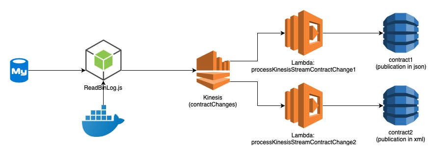
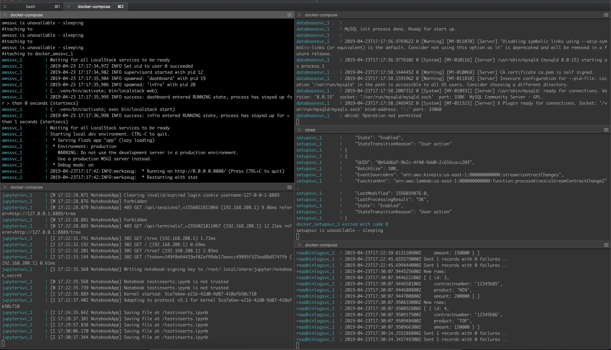

  

# stream-my-changes - a local docker setup for streaming mysql changes via AWS Kinesis, AWS Lambda to AWS DynamoDB

Docker setup for streaming mysql changes to several dynamoDB's on a local machine in order to be able to locally test this setup and changes in the AWS lambda's.

Here you see how this setup is setup:


The mysql database writes the changes to the binlog. The ROW format is used so it can be read by the ReadBinLog.js script. This script is launched in it's own nodejs docker environment and uses the Zongji library for reading the binlog. In this example only the primary key of the changed row is passed on via the stream.

The ReadBinLog script is the producer for an AWS Kinesis stream. In the example we have two Lambda functions that are registered as consumer of the Kinesis stream. Both Lambda's read the original mysql database for retrieving the most recent data (and join it with some other table). Lambda no.1 publishes the data in json format into a dynamoDB (contract1). Lambda no.2 publishes the data in xml format into a dynamoDB (contract2).

# Installation
Download [Docker Desktop](https://www.docker.com/products/docker-desktop) for Mac or Windows. [Docker Compose](https://docs.docker.com/compose) will be automatically installed. On Linux, make sure you have the latest version of [Compose](https://docs.docker.com/compose/install/).

Download this git repository and use docker compose to build and start the containers:
``` bash
docker-compose up --build -d
```

This will spin up several containers (mysql, readbinlog, aws and jupyter, see also below).

# Logging
You can show all logs by using the ./log.sh script:
```bash
./log.sh
```
When reading logs and debugging it comes in handy when you can read the services separately. You can for example create a dashboard like this when running the log script in several terminals:

This can be done by running the logscript with the service as argument:
```bash
./log.sh <service>
```
The following services can be used:
* awssvc
* jupytersvc
* databasesvc
* readbinlogsvc
* setupsvc (this is a temporary service for setting up the AWS services)


# Running some examples
The jupyter notebook container is used for easily running some statements within this setup. You can also easily use this as a playground and (re)run some other statements. Note: the current notebook is saved within the container and changes will be lost after bringing down the container.

Opening http://127.0.0.1:8889 will open the notebook.
In this example you can run through the different steps for retrieving current data in mysql and dynamo, add some rows to the mysql database and show the result in the dynamodb. Here you can add your own steps.

# Used containers
The definition of the several containers can be found in the docker-compose.yml file. The following services are defined:
* awssvc - for setting up the localstack supported aws services: DynamoDB, Kinesis and Lambda
* jupytersvc - for running the examples
* databasesvc - for the mysql server
* readbinlogsvc - for the binlog reader and kinesis producer
* setupsvc - this is a temporary service for setting up the AWS services

Note that these services can also be setup in the AWS cloud. Use RDS for the mysql database. Run the readbinlog application via ECR/ECS and eventually EKS/Fargate etc.

Setting the DEBUG setting to 1 in the docker-compose for the awssvc service shows the logging of the Lambda's in the awssvc log. 

# Changing Lambda code
T.b.d.

# Notes
* You can check the installed AWS components in Localstack in your browser via http://localhost:8055

# ToDo's
|Nr.| Description |
|-----|----------------------------------|
|1| Showing the logs of the lambda's (via cloudwatch?)|
|2| Adding processing of update and delete statements in the lambda's|
|3| Adding explanation / example for changing the lambda code

# Version log
|Date|Version|Description|
|----|-------|-----------|
|2019-04-22|0.0.1| First draft|
